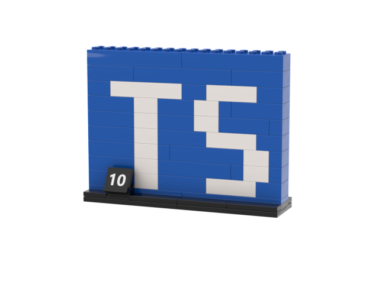

# TypeScript 10th anniversary Lego set

[Download pdf instructions](TypeScript-Lego.pdf)
[Download Studio model](TypeScript-10Year.io)

## Lego part list

|BLItemNo|ElementId|LdrawId|PartName                   |BLColorId|LDrawColorId|ColorName|ColorCategory|Qty|Weight|
|--------|---------|-------|---------------------------|---------|------------|---------|-------------|---|------|
|2431    |243126   |2431   |Tile 1 x 4                 |11       |0           |Black    |Solid Colors |7  |0.54  |
|2456    |4181142  |2456   |Brick 2 x 6                |1        |15          |White    |Solid Colors |1  |3.74  |
|2456    |4181139  |2456   |Brick 2 x 6                |7        |1           |Blue     |Solid Colors |2  |3.74  |
|3001    |300123   |3001   |Brick 2 x 4                |7        |1           |Blue     |Solid Colors |12 |2.32  |
|3001    |300101   |3001   |Brick 2 x 4                |1        |15          |White    |Solid Colors |3  |2.32  |
|3002    |300223   |3002   |Brick 2 x 3                |7        |1           |Blue     |Solid Colors |2  |1.92  |
|3003    |300323   |3003   |Brick 2 x 2                |7        |1           |Blue     |Solid Colors |5  |1.35  |
|3003    |300301   |3003   |Brick 2 x 2                |1        |15          |White    |Solid Colors |10 |1.35  |
|3004    |300423   |3004   |Brick 1 x 2                |7        |1           |Blue     |Solid Colors |6  |0.8   |
|3007    |6037384  |3007   |Brick 2 x 8                |7        |1           |Blue     |Solid Colors |3  |4.75  |
|3020    |302026   |3020   |Plate 2 x 4                |11       |0           |Black    |Solid Colors |2  |1.2   |
|3034    |303426   |3034   |Plate 2 x 8                |11       |0           |Black    |Solid Colors |1  |2.27  |
|3034    |303423   |3034   |Plate 2 x 8                |7        |1           |Blue     |Solid Colors |2  |2.27  |
|3035    |303526   |3035   |Plate 4 x 8                |11       |0           |Black    |Solid Colors |2  |4.7   |
|3069b   |306926   |3069b  |Tile 1 x 2 with Groove     |11       |0           |Black    |Solid Colors |1  |0.26  |
|3937    |393726   |3937   |Hinge Brick 1 x 2 Base     |11       |0           |Black    |Solid Colors |1  |0.48  |
|6134    |4124096  |6134   |Hinge Brick 2 x 2 Top Plate|11       |0           |Black    |Solid Colors |1  |0.47  |
